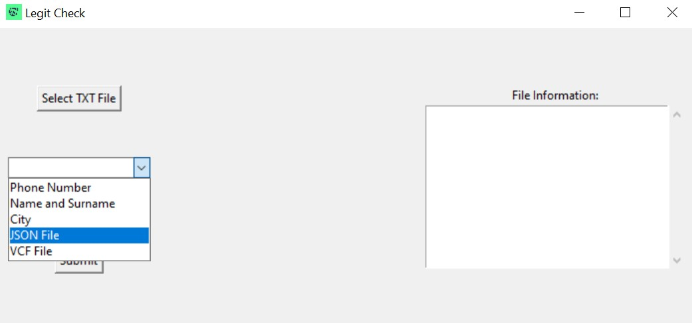

# pandabuy legit check

# The application does not contain the pandabuy database and is only for people who are authorized to have it

Legit Check is a simple program for searching legit users in pandabuy txt database. It allows the user to select a file, specify search criteria, and then search matching users in JSON file(first name and last name from Facebook friends), VCF file(phone numbers from your phone's contacts) or specify search criteria.

## How to Use the Program

### 1. Select TXT File

- Click the "Select TXT File" button to choose the pandabuy leak data text file.
- After selecting the file, its path will be displayed below the button.

### 2. Choose Search Criteria

- Choose one of the available search criteria from the "Search Options" dropdown menu:
  - **Phone Number**: Search by phone number.
  - **Name and Surname**: Search by name and surname.
  - **JSON File**: Search for information based on your facebook friends. your friends list will be displayed on the right.
  - **VCF File**: Search for information based on phone numbers from your contacts on your phone, your list of phone numbers will be displayed on the right.
### 3. Enter Search Data

- Depending on the chosen criteria, enter the appropriate search data:
  - For **Phone Number** or **Name and Surname**: Enter the phone number or name and surname in the text field.
  - For **JSON File** Enter cities name to filter data or Leave the text field empty.
  - For **VCF File**: Leave the text field empty.

### 4. Submit Search

- After entering the search data, click the "Submit" button to start the search.

### 5. Displaying Results

- After the search is complete, the results will be displayed in a new window.
- If no matching records are found, a message indicating no results will be displayed.

## How to download your Facebook friends list to search for friends using Pandabuy
1. Log in to your Facebook account.
2. Click on your profile picture in the top right corner, then click on Settings & Privacy.
3. Click on Settings.
4. Click on Account Center and then Your Information and Privacy.
5. Click on Download Your Information.
6. Click on Download Your Information or Transfer Your Information.
7. Click on Specific types of information.
8. Select Friends and click Next.
9. Choose Download your information to your device and click Next.
10. Choose Whole Period in Date Range and Save.
11. Choose JSON in Format and Save.
12. Choose High in Media Quality and Save.
13. Click on Create File.
14. After a few minutes, in Download Your Information under the Current Activity tab, click Download.
15. Extract the zip file.
16. Your friends list file is located in connections/friends/your_friends.json.

## How to download your phone contacts to search by phone number for friends using Pandabuy
### For Samsung users
1. Open the Contacts app on your phone.
2. Click on settings in the top right corner.
3. Click on Share.
4. Select all contacts.
5. Share contacts through your chosen option (e.g., send an email to your inbox).
6. Download the shared file to your computer.

## System Requirements

- **Operating System**: Windows, macOS, Linux
- **Python Version**: 3.x (preferably 3.6 or newer)
- **External Libraries**:
  - Tkinter (usually comes pre-installed with Python)
  - Pillow (Python Imaging Library, install with `pip install Pillow`)


## Running the Program

1. Download the repository with the source code of the Legit Check application.
2. Run the program by executing the `gui.py` file in the terminal or Python environment.

```bash
python gui.py
